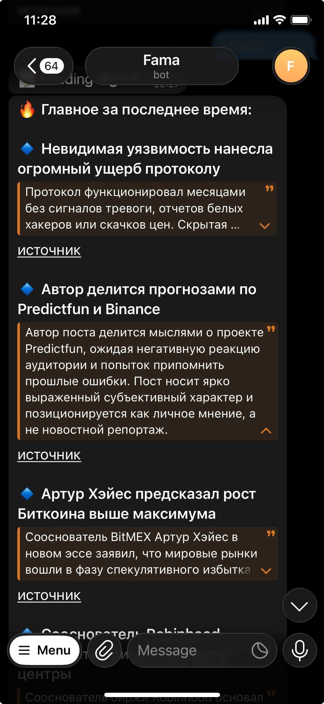

# 📡 News Radar

**A multi-source AI radar that ranks by practical value, not by volume.**

Pulls from Telegram, RSS and Hacker News, runs every item through an LLM pipeline, deduplicates the same story across sources semantically, clusters what's actually trending, and ships a short digest to Telegram. Runs entirely in Docker, on a local GPU or any OpenAI-compatible endpoint.


---

<p align="center">
  
</p>

<p align="center"><sub>A digest arriving in Telegram — <code>spoiler</code> template: headline, one tap to expand the summary, link to the original.<br>Shown running the production crypto profile, the domain the engine was proven on.</sub></p>

## The problem

A feed optimizes for loud. Twelve channels break the same story within minutes, an announcement with no details outranks a write-up with a measurable result, and the one post that would actually change how you work tomorrow scrolls past at 3am.

News Radar inverts the ranking. Each item is scored for **practical applicability** — can someone who already uses AI tools do something differently after reading this? — and only the top of that ranking reaches the digest. Hype gets exactly one slot.

The engine is not a hackathon prototype: it has been running in production against 57+ Telegram channels in the crypto domain, which is where the dedup economics, trend clustering and digest queue were proven on 100–200 messages a day. What's in flight now is re-pointing that engine at AI content — same core, new collectors, new scoring profile, everything behind feature flags so the production path never breaks.

## Pipeline

```
   Telegram userbot          RSS / Atom              Hacker News
   57+ channels              6 AI feeds              Algolia API
   realtime + catchup        poll, 60 min            points ≥ 30
          │                       │                       │
          └───────────────────────┼───────────────────────┘
                                  ▼
                    ┌─────────────────────────────┐
                    │  NORMALIZE   RawMessage      │  URL dedup, age window,
                    │  source-agnostic core        │  polite full-text fetch
                    └──────────────┬──────────────┘
                                   ▼
                    ┌─────────────────────────────┐
                    │  CHEAP FILTERS (no LLM)      │  length, ad heuristics,
                    │  ~50% dropped before spend   │  semantic dedup ≥ 0.90
                    └──────────────┬──────────────┘
                                   ▼
                    ┌─────────────────────────────┐
                    │  LLM ANALYSIS                │  importance 1–10, topic,
                    │  structured JSON out         │  summary, sentiment, is_ad
                    └──────────────┬──────────────┘
                                   ▼
          ┌────────────────────────┼────────────────────────┐
          ▼                        ▼                        ▼
   BGE-m3 → ChromaDB      HDBSCAN clustering         priority queue
   dedup + search         TrendScore, 15 min         → digest → Telegram
```

## Status

The project runs against a written spec with numbered iterations; this table is the real state of the tree, not a wish list. Full detail in [`specs/STATE.md`](specs/STATE.md).

| Capability | Status |
|---|---|
| Telegram collection — realtime listener + smart catch-up on restart | ✅ in production |
| LLM analysis — importance, topic, summary, sentiment, ad flag | ✅ in production |
| Semantic dedup — BGE-m3 embeddings in ChromaDB, 0.90 threshold | ✅ in production |
| Trend detection — HDBSCAN clustering + composite TrendScore | ✅ in production |
| Digests — `classic` (Markdown) and `spoiler` (expandable HTML) templates | ✅ in production |
| Breaking alerts and hot-trend alerts to Telegram | ✅ in production |
| FastAPI service — feed, search, topics, trends, digest, similar | ✅ in production |
| Hot-reload config — thresholds and source lists change without restart | ✅ in production |
| `llm_core` — portable LLM layer: retry, usage accounting, secret masking, schema validation | ✅ shipped, `mypy --strict` |
| RSS + Hacker News collectors — poll mode, URL normalization, age window, fair full-text budget | ✅ shipped, off by default (`--profile feeds`) |
| Cloud LLM mode — any OpenAI-compatible endpoint instead of the local GPU | 🚧 wired, one known API-key bug to fix first |
| `ai_value` scoring profile — `content_type`, `value_score`, `takeaway`, quota-based rerank | 🚧 next iteration; golden set labelled (34 items), evals written |
| `ai_value` digest template — accordion: headline → one-line takeaway → source | ⬜ planned |
| Knowledge base — condensed Markdown write-up per item, pushed to GitHub | ⬜ planned |
| GitHub + Reddit collectors | ⬜ planned |
| Discord, X/Twitter, on-chain data | ⬜ backlog |

## Engineering notes

**Paying once for a story twelve sources break.** A single event gets reposted across a dozen channels within minutes. BGE-m3 embeddings in ChromaDB catch that before the expensive call: above 0.90 cosine similarity the existing analysis is cloned, so twelve copies cost one LLM call instead of twelve. Combined with length and ad heuristics, roughly half of all input never reaches the model.

**Trends, not a firehose.** HDBSCAN clusters the recent window every 15 minutes. A composite TrendScore ranks clusters by unique sources × average importance × recency × reach, and a cluster crossing the source-diversity threshold fires an alert — five independent channels saying the same thing is signal, one channel saying it five times is not.

**Age window before spend.** Feeds like OpenAI's happily return years of archive on first poll. Anything older than `sources.max_age_hours` is dropped *before* the full-text fetch and before the database write, and URLs are normalized (`utm_*`, `fbclid`, fragments, trailing slash) so the same article arriving via RSS and Hacker News is one row, not two.

**Fair full-text budget.** Articles arriving as snippets get their body fetched politely: a per-cycle ceiling plus a per-feed cap, so one chatty feed can't eat the budget for the rest; a domain answering 401/403 is skipped for the remainder of the cycle.

**Untrusted input is treated as untrusted.** Article bodies and README text are third-party data that can contain instructions. Content is fenced in the prompt and explicitly marked as data-only, and the model answers into a validated JSON schema rather than free text.

**SQLite in WAL mode** lets the ingest loop write while the API reads, without the lock contention that usually pushes a project this size onto Postgres prematurely.

**Source-agnostic core.** Collectors normalize into one `RawMessage`; the analyzer has no idea whether an item came from Telegram, RSS or Hacker News. A new source is a new subclass, not a change to the pipeline.

**Provider-agnostic LLM layer.** `llm_core/` is a self-contained package — client, provider registry, retry, usage accounting, secret masking, response validation — held to `mypy --strict`. It targets any OpenAI-compatible endpoint, so the same pipeline runs on a local Qwen3 35B or on a hosted API by changing two environment variables.

## The value model

The scoring profile currently in flight replaces "how hot is this" with "what can a reader do with it". Every item is classified into:

```json
{
  "content_type": "practical_case | tutorial | tool_release | research | opinion | hype_news",
  "value_score": 1-10,
  "has_outcome": true,
  "takeaway": "one line: who applied what, and what came out of it",
  "topic": "agents | llm_ops | integrations | models | infra | other"
}
```

The digest is then filled by quota rather than by score alone — cases and tutorials are the body of it, tool releases and research get a couple of slots, and hype gets **at most one**. The ranking priority is applicability for someone using existing AI tools; a paper with impressive numbers about training your own model scores lower than a write-up on integrating a tool that already exists.

This is eval-driven, not vibes-driven: 34 real items from a live collector run were hand-labelled into a dated golden set (`tests/golden/`), and the classifier has to clear thresholds against it — most importantly, hype never scores ≥ 8. The labelling carries an explicit expiry note: when the owner's focus shifts, the set is re-labelled rather than the classifier being tuned to match old labels.

## Stack

Python 3.11 · FastAPI · Telethon · feedparser · trafilatura · Qwen3 35B (vLLM / Ollama) or any OpenAI-compatible API · BGE-m3 (sentence-transformers) · ChromaDB · HDBSCAN · SQLite (WAL) · python-telegram-bot · Docker Compose · pytest · mypy

## Quick start

Everything runs in Docker — nothing is installed on the host.

```bash
cp .env.example .env     # Telegram credentials + LLM endpoint
docker compose up -d     # chromadb, collector, analyzer, api, bot
```

| Variable | Where to get it | Required |
|---|---|:--:|
| `TELEGRAM_API_ID` / `TELEGRAM_API_HASH` | https://my.telegram.org/apps | ✅ |
| `TELEGRAM_BOT_TOKEN` | @BotFather | ✅ |
| `TELEGRAM_ALLOWED_USERS` | @userinfobot | ✅ |
| `LLM_BASE_URL` | local server or hosted API (`.../v1`) | ✅ |
| `LLM_API_KEY` / `LLM_MODEL` | required in cloud mode | |
| `GITHUB_TOKEN` | for the knowledge-base publisher | |

The collector is a Telegram **userbot**, so it needs a one-time interactive login:

```bash
docker compose run --rm collector   # phone number + SMS code, session persists in data/sessions/
```

Health check:

```bash
curl http://localhost:8100/health
curl http://localhost:8100/trends
docker logs news-radar-analyzer -f
```

The RSS and Hacker News collectors are off by default and live in a separate compose profile, so a normal `up -d` never starts them:

```bash
docker compose --profile feeds up -d collector-feeds
```

## Configuration

All tuning lives in `config/settings.json` and applies within ~3 seconds, no restart:

```json
{
  "digest_template":         "spoiler",
  "breaking_alert_min_temp":  9,
  "hot_trend_min_sources":    5,
  "trend_hdbscan_epsilon":    0.25,
  "llm_concurrency":          3,
  "llm_local_mode":           true,
  "sources": {
    "max_age_hours": 72,
    "fulltext":   { "max_per_cycle": 20, "max_per_feed": 5 },
    "rss":        { "enabled": false, "poll_minutes": 60 },
    "hackernews": { "enabled": false, "min_points": 30 }
  }
}
```

Secrets never go here — they live in `.env` only.

## Telegram bot

| Command | What it does |
|---|---|
| `/digest` · `/digest new` · `/digest new 6` | last digest, a fresh one, or one over the last 6 hours |
| `/hot` | trends firing right now |
| `/track <topic>` · `/untrack <topic>` | subscribe to a topic |
| `/ask <question>` | ask the agent about the collected corpus |
| `/status` | pipeline statistics |

## Project layout

```
news-radar/
├── collectors/       telegram.py · rss.py · hackernews.py · fulltext_fetcher.py · poll_runner.py
├── llm_core/         portable LLM layer: client · providers · usage · mask · validator
├── analyzer/         pipeline · trend_tracker · embedder · chroma_client · prompts · renderer
├── api/              FastAPI service (:8100)
├── bot/              Telegram bot
├── database/         SQLite schema + migrations
├── config/           settings.json · topics.json · hot-reload watcher
├── specs/            spec, iteration state, acceptance reports
├── docs/             12 architecture documents
└── tests/            60 tests + golden set for classifier evals
```

## How this is built

The project is developed spec-first, by an architect/implementer split where both are LLMs and the owner accepts the work:

- **One spec, versioned.** Every change to `specs/tz4-ai-value.md` is a changelog line and its own commit. The spec is the contract; the chat is not.
- **Small iterations.** Each one ships behind feature flags whose defaults preserve production behaviour, and closes only when its own acceptance criteria are green. Rejections are recorded — iteration 2 was sent back once and closed as 2.1.
- **Typed from day one.** New modules carry full annotations and pass `mypy --strict`; legacy code is tightened only where it's touched.
- **Tests track behaviour, not coverage.** Tests are written for acceptance criteria and for bugs actually found. Weakening an existing test to make new code pass is not allowed.
- **Eval-driven for anything the model decides.** A hand-labelled golden set gates the classifier before it ranks anything real.
- **Docker-only.** Every run, test and migration happens inside the container; the host stays clean.

`docs/11_problems_learned.md` accumulates the traps found along the way — the config watcher that silently ignores keys missing from `DEFAULT_CONFIG`, the archive-dumping feeds, the endpoint that reports `prompt_tokens: 0`.

## Roadmap

- 🚧 `ai_value` classifier + quota rerank, gated on the golden set
- 🚧 Cloud LLM mode on an OpenAI-compatible endpoint
- ⬜ `ai_value` digest template — accordion with a one-line takeaway per item
- ⬜ Markdown knowledge base pushed to GitHub, one condensed write-up per item
- ⬜ GitHub and Reddit collectors
- ⬜ Discord · X/Twitter · on-chain data

## License

Source-available, all rights reserved — see [`LICENSE`](LICENSE). The code is public so it can be read and reviewed; it is not licensed for use or redistribution while the project is still in active development. An open source licence is on the table once it settles. For anything beyond reading, ask.
